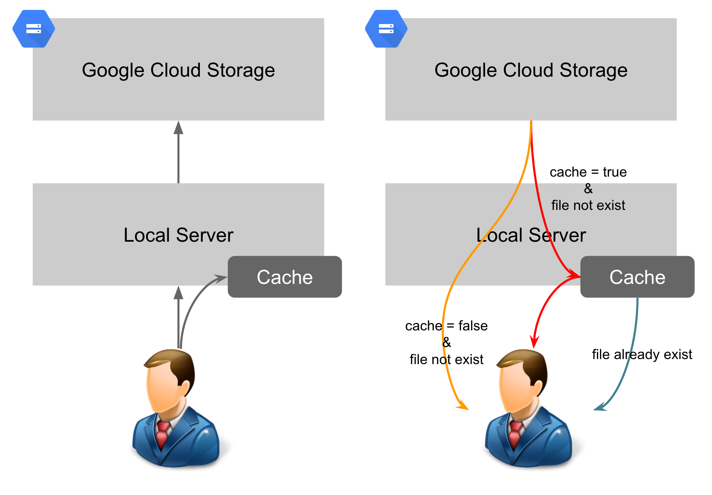

# Express GCS Uploader

This is a express upload plugin that will auto copy the upload data to Google Cloud Storage. And also have a download strategy for choice: 

* Download from local if local have the file
* Download from GCS directly
* Download from GCS and cache to local



Note: All the service is base on [multr](https://github.com/expressjs/multer), if you want to add more into the option, you can reference to multr's option.

## Installation

```
npm install express-gcs-uploader --save
```

## Setup

### Step1: setup the auth and related configuration

```
var gcsuplder = require('express-gcs-uploader');
gcsuplder.auth({
  rootdir: __dirname,
  upload_url: '/uploads',
  download_url: '/download',
  cdn_url: 'http://your.bucket.com.tw', //option: for gcs public read or something like that
  keep_filename: true, //option: use for keep the original file name in the remote
  cache: true, //option: will write to local everytime when read from gcs
  bucket: 'your.bucket.com.tw',
  projectId: 'your-project-id',
  keyFilename: '/path/to/your/key.json'
});
```

The configuration detail describe below: 

* rootdir (string): The project root path.
* upload_url (string): The upload folder path.
* download_url (string): The download url.
* cdn_url (string): The cache url, like CDN path or your cloud storage web site bucket path.
* keep_filename (boolean): If you want to keep the filename, use true for rename the random filename to yours. 
* cache (boolean): If you want to cache the data to local that read from gcs, use true...
* bucket: The cloud storage bucket name for store your data.
* projectId: The project id that your json key create.
* keyFilename: The json key path of a service account that create from GCP console.

### Step2: Setup the download route

```
app.use('/downloads/:id', gcsuplder.downloadproxy);
```

In this case, the route like: http://localhost:3000/downloads/e13b6a98a0d50b5990123a83eb87f2a8.png will listen the resource get. And the ":id " will be the filename that we can get from our upload.

## Cloud Storage Default ACL Setting

If you want use the "cdn_url" to let cloud storage web site bucket can be your CDN path. You should set the default acl to the bucket objects for the uploaded object to grant a default read permission. ( About the website bucket, please reference to the doc: https://cloud.google.com/storage/docs/website-configuration )

```
gsutil defacl ch  -p allUsers:R gs://your.bucket.com.tw
```


